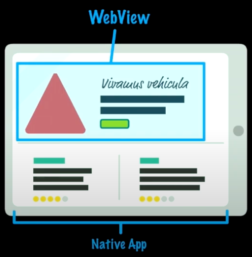

# 웹뷰란 무엇일까?

> 웹뷰(WebView)는 네이티브 앱에 내재되어 있는 웹 브라우저이다.



- 웹뷰를 사용하면 웹 콘텐츠를 네이티브 앱 뷰와 같이 사용자에게 보여줄 수 있다.
- 일반 웹 브라우저와 달리 웹뷰에는 주소창, 새로고침, 즐겨찾기와 같은 기능은 없고 단순히 웹페이지만 보여준다.

### Google에서 Android WebView 클래스를 아래와 같이 정의하고 있다

WebView 클래스는 Android의 View 클래스의 확장으로, 웹페이지를 활동 레이아웃의 일부로 표시할 수 있게 해준다. 탐색 컨트롤이나 주소 표시줄 등 완전히 개발된 웹브라우저의 기능은 전혀 포함되어 있지 않다. WebView의 모든 작업은 기본적으로 웹페이지를 표시하는 것이다. - WebView에서 웹 앱 빌드

### Apple에서 iOS WKWebView 클래스를 아래와 같이 정의하고 있다.

WKWebView 객체는 앱 UI에 매끄럽게 통합되는 네이티브 뷰이다. 웹뷰는 HTML, CSS 및 JavaScript 콘텐츠를 지원하는 웹 브라우징 경험을 제공하며 네이티브 뷰와 함께 사용할 수 있다. - WKWebView Class

## 웹뷰의 장점

**1. 여러 플랫폼에서 사용할 수 있다.**

웹페이지, Android 앱, iOS 앱을 모두 구현하려면 각 플랫폼에서 다른 언어로 개발해야 된다. 하지만 웹페이지 하나를 만들어놓고 Android, iOS에서 웹뷰를 사용하면 한 번만 개발해서 세 개의 플랫폼에 사용할 수 있다. 초기 개발 비용을 최소화하고 유지 보수도 더 편리하다.<br/>

```
대표적인 웹뷰 사용 예시

1. 네이버 스마트 스토어도 웹뷰 방식 사용
2. 토스 -> 외부 앱(3rd-party 앱)을 연동시 사용되고 있음
3. 무신사
```

**2. 배포 없이 업데이트**

앱을 배포하려면 스토어 심사가 필요하다. 하지만 웹뷰를 사용하면 앱 심사를 하지 않아도 웹사이트 내용을 수정할 수 있다. 자주 바뀌거나 빠르게 업데이트가 필요한 화면은 웹뷰로 구현하면 좋다.

**3. 인터넷 연결이 필요한 데이터를 간단히 불러온다**
이메일과 같은 데이터는 항상 인터넷 연결이 필요하다. 이러한 데이터는 네이티브 앱으로 네트워크를 설정하고, 데이터를 불러와서 앱 위에서 보여주는 것보다 항상 인터넷에 연결되어 있는 웹뷰로 보여주는 게 더 쉽다.

## 웹뷰의 단점

**1. 비교적 느리다**

네이티브 앱에 비해 로딩 시간이 느리다. 네이티브 앱은 이미 스토어에서 빌드가 완료되지만, 웹뷰는 해당 사이트에서 사용하는 리소스를 다운로드하고 보여주는 데 시간이 필요하다. 로딩 시간이 길어지면 사용자 경험에 안 좋은 영향을 끼칠 수 있다.

**2. 제한적이다**

웹뷰는 HTML, CSS, JavaScript를 사용하기 때문에, 네이티브 앱의 UI를 구성하는 것보다 제약적이다. 각 플랫폼에서 제공하는 모든 UI 또는 UX를 웹뷰에서 사용하기 어렵다.

웹뷰는 브라우져를 띄우는 개념이라 디바이스를 컨트롤 할 수 없다.

**3. 스토어 심사가 어려울 수 있다**

웹뷰만으로 구성된 앱은 스토어 심사가 어려울 수도 있다. 허가 없는 웹사이트를 무단으로 사용하거나, 웹사이트만 보여주는 단순한 앱이 스토어에 등록되는 걸 방지하고 있기 때문이다. Google의 [WebView 및 제휴사 스팸 정책](https://support.google.com/googleplay/android-developer/answer/9899034?hl=ko), [Apple의 Minimum Functionality 정책](https://docs.tosspayments.com/resources/glossary/webview)을 잘 확인하자.

## 웹뷰 연동 참고 레퍼런스

https://docs.tosspayments.com/guides/webview
