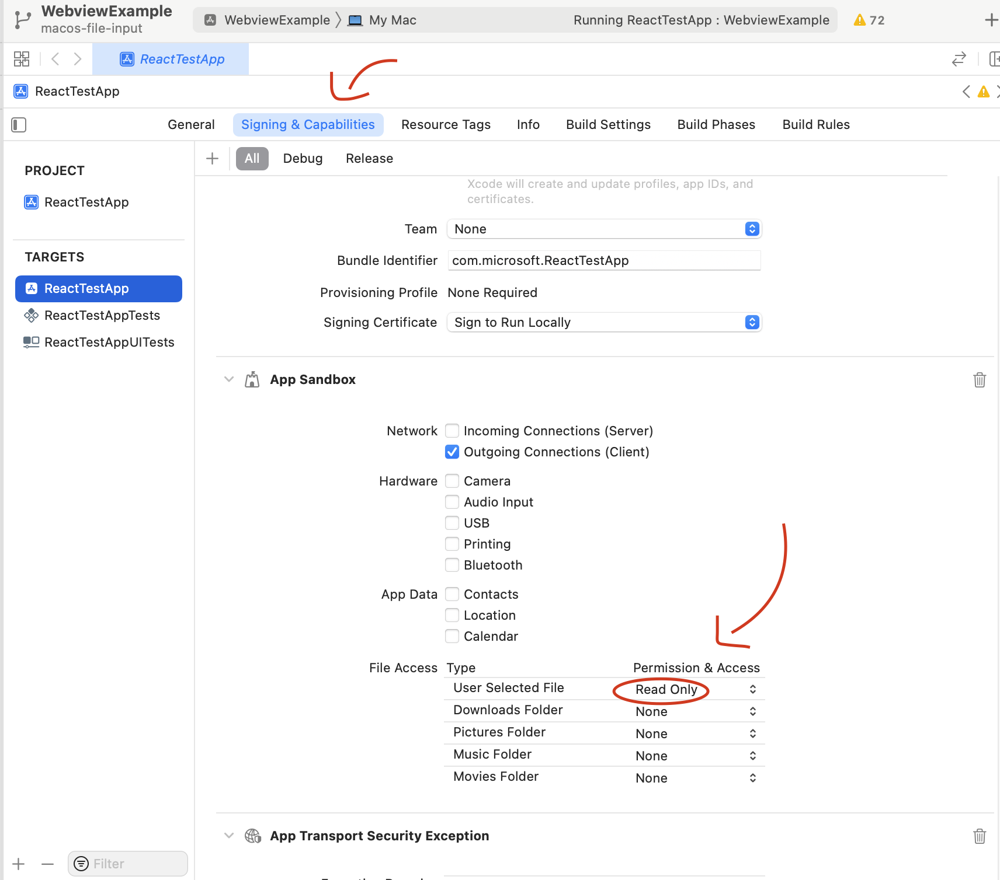
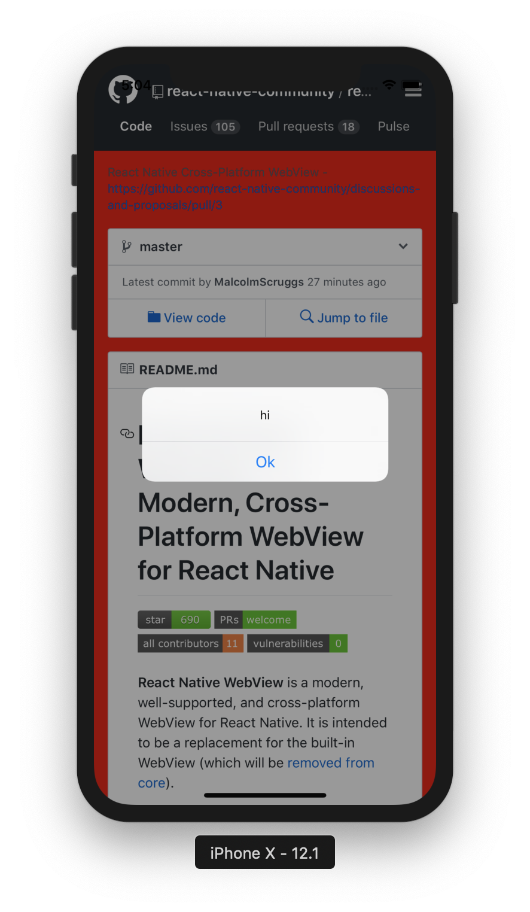

## 가이드 목차

- 기본 인라인 HTML
- 기본 URL 소스
- 로컬 HTML 파일 로드
- 탐색 상태 제어
- 파일 업로드 지원 추가
- 다중 파일 업로드
- 파일 다운로드 지원 추가
- JS와 네이티브 간의 통신
- 사용자 정의 헤더, 세션 및 쿠키 사용
- 페이지 탐색 제스처 및 버튼 지원

## 기본 인라인 HTML

WebView를 사용하는 가장 간단한 방법은 표시할 HTML을 그대로 전달하는 것이다. html 소스를 설정할 때는 originWhiteList 속성을 ['*']로 설정해야한다.

```js
import React, { Component } from "react";
import { WebView } from "react-native-webview";

class MyInlineWeb extends Component {
  render() {
    return (
      <WebView
        originWhitelist={["*"]}
        source={{ html: "<h1>This is a static HTML source!</h1>" }}
      />
    );
  }
}
```

-> 새로운 정적인 html 소스를 전달하면 WebView가 다시 렌더링된다

## 기본 URL 소스

WebView에서 가장 일반적인으로 사용되는 방법이다.

```js
import React, { Component } from "react";
import { WebView } from "react-native-webview";

class MyWeb extends Component {
  render() {
    return (
      <WebView
        source={{
          uri: "https://reactnative.dev/",
        }}
      />
    );
  }
}
```

## 로컬 HTML 파일 로드하기

때때로 앱과 함께 HTML 파일을 번들로 제공하고 WebView에 해당 HTML을 로드하고 싶을 수 있다.

iOS와 Windows에서는 아래와 같이 HTML 파일을 다른 자산처럼 가져올 수 있다.

```js
import React, { Component } from "react";
import { WebView } from "react-native-webview";

const myHtmlFile = require("./my-asset-folder/local-site.html");

class MyWeb extends Component {
  render() {
    return <WebView source={myHtmlFile} />;
  }
}
```

하지만 Android에서는 HTML 파일을 Android 프로젝트의 디렉터리에 넣어야 한다. 예를 들어, local-site.html이 HTML 파일이고 이 파일을 WebView에 로드하려면 해당 파일을 프로젝트의 Android 디렉터리 (your-project/android/app/src/main/assets/)로 이동해야한다.

```js
import React, { Component } from "react";
import { WebView } from "react-native-webview";

class MyWeb extends Component {
  render() {
    return (
      <WebView source={{ uri: "file:///android_asset/local-site.html" }} />
    );
  }
}
```

## 탐색 상태 변경 제어

때로는 사용자가 WebView에서 링크를 클릭했을 때 다른 작업을 수행하거나 해당 링크로 이동하는 대신 다른 처리를 하고 싶을 수 있다.

- `onNavigationStateChange` 함수를 사용하여 이 작업을 수행하는 예시 코드

```js
import React, { Component } from "react";
import { WebView } from "react-native-webview";

class MyWeb extends Component {
  webview = null;

  render() {
    return (
      <WebView
        ref={(ref) => (this.webview = ref)}
        source={{ uri: "https://reactnative.dev/" }}
        onNavigationStateChange={this.handleWebViewNavigationStateChange}
      />
    );
  }

  handleWebViewNavigationStateChange = (newNavState) => {
    // newNavState looks something like this:
    // {
    //   url?: string;
    //   title?: string;
    //   loading?: boolean;
    //   canGoBack?: boolean;
    //   canGoForward?: boolean;
    // }
    const { url } = newNavState;
    if (!url) return;

    // handle certain doctypes
    if (url.includes(".pdf")) {
      this.webview.stopLoading();
      // open a modal with the PDF viewer
    }

    // one way to handle a successful form submit is via query strings
    if (url.includes("?message=success")) {
      this.webview.stopLoading();
      // maybe close this view?
    }

    // one way to handle errors is via query string
    if (url.includes("?errors=true")) {
      this.webview.stopLoading();
    }

    // redirect somewhere else
    if (url.includes("google.com")) {
      const newURL = "https://reactnative.dev/";
      const redirectTo = 'window.location = "' + newURL + '"';
      this.webview.injectJavaScript(redirectTo);
    }
  };
}
```

## 파일 업로드 지원 추가

### iOS

: iOS에서는 ios/[project]/Info.plist 파일에 다음과 같은 권한을 지정하면 된다.

#### 사진 촬영

```js
<key>NSCameraUsageDescription</key>
<string>Take pictures for certain activities</string>
```

#### 갤러리 선택

```js
<key>NSPhotoLibraryUsageDescription</key>
<string>Select pictures for certain activities</string>
```

#### 동영상 녹화

```js
<key>NSMicrophoneUsageDescription</key>
<string>Need microphone access for recording videos</string>
```

### Android

: Android에서는 AndroidManifest.xml 파일에 권한을 추가하면 된다

```js
<manifest ...>
  ......

  <!-- this is required only for Android 4.1-5.1 (api 16-22)  -->
  <uses-permission android:name="android.permission.WRITE_EXTERNAL_STORAGE" />

  ......
</manifest>
```

#### Android에서 카메라 옵션 활성화

: 파일 입력에서 accept 속성을 통해 이미지나 비디오를 요구할 경우, WebView는 사용자가 카메라를 이용해 사진이나 비디오를 촬영할 수 있는 옵션을 제공한다.

```js
<queries>
  <intent>
    <action android:name="android.media.action.IMAGE_CAPTURE" />
  </intent>
</queries>
```

또한 카메라가 capture 속성으로 지정된 경우, AndroidManifest.xml 파일에 다음을 추가해야 일부 Android 버전 및 기기에서 카메라가 일관되게 작동한다.

#### 파일 업로드 지원 확인 필요 (static isFileUploadSupported() 사용)

- Android 4.4 KitKat에서는 `<input type="file" />` 를 사용한 파일 업로드가 지원되지 않음

```js
import { WebView } from "react-native-webview";

WebView.isFileUploadSupported().then((res) => {
  if (res === true) {
    // 파일 업로드가 지원됨
  } else {
    // 파일 업로드가 지원되지 않음
  }
});
```

- MacOS 서명 및 기능(Signing & Capabilities) 탭에서 "사용자가 선택한 파일 읽기(Read access for User Selected File)" 권한을 추가해야함
- (App Sandbox 섹션):
  
  : 위 권한 설정없이 파일 입력을 열려고 하면 WebView가 충돌할 수 있다.

#### 다중 파일 업로드 input 요소에 multiple 속성을 지정하여 파일 선택을 단일 또는 다중으로 제어할 수 있다.

```js
// 다중 파일 선택
<input type="file" multiple />

// 단일 파일 선택
<input type="file" />
```

## 파일 다운로드 지원 추가

### iOS

iOS에서 파일을 다운로드하려면 자체 코드를 작성해야 한다. WebView 컴포넌트에 onFileDownload 콜백을 prop으로 제공할 수 있다. RNCWebView가 파일 다운로드가 필요하다고 판단하면, 파일을 다운로드할 수 있는 URL이 onFileDownload에 전달된다. 이 콜백에서 파일을 원하는 방식으로 다운로드할 수 있다.

**참고: iOS 13 이상만 최상의 다운로드 환경이 제공된다.** <br/>
: iOS 13에서는 HTTP 응답 헤더에 액세스할 수 있는 API가 추가되어 HTTP 응답이 다운로드인지 여부를 결정할 수 있다. iOS 12 이하에서는 웹뷰에서 렌더링할 수 없는 MIME 유형만 onFileDownload 호출을 트리거한다.

`예시 코드`

```js
onFileDownload = ({ nativeEvent }) => {
  const { downloadUrl } = nativeEvent;
  // --> 여기에 파일 다운로드 코드를 작성하세요 <--
};
```

이미지를 갤러리에 저장하려면 ios/[project]/Info.plist 파일에 다음 권한을 지정해야 한다.

```js
<key>NSPhotoLibraryAddUsageDescription</key>
<string>Save pictures for certain activities.</string>
```

### Android

Android에서는 DownloadManager와의 통합이 기본적으로 제공된다.

Android 10 미만 버전 앱의 경우, AndroidManifest.xml에 다음 권한을 추가하자

```js
<manifest ...>
  ......

  <!-- Android 10 미만 버전에서 파일을 저장하려면 이 권한이 필요하다 -->
  <uses-permission android:name="android.permission.WRITE_EXTERNAL_STORAGE" />

  ......
</manifest>

```

## JavaScript와 네이티브 간의 통신

React Native WebView를 사용하면 네이티브 앱에서 웹 페이지로 메시지를 보내거나 웹 페이지에서 메시지를 받아오는 상황이 자주 발생한다.

**이를 위해 React Native WebView는 세 가지 옵션을 제공된다**

1. React Native -> Web: **injectedJavaScript prop**
2. React Native -> Web: **injectJavaScript 메서드**
3. Web -> React Native: **postMessage 메서드**와 **onMessage prop**

### injectedJavaScript prop

: `injectedJavaScript`는 웹 페이지가 처음 로드된 직후 실행되는 스크립트이다. 이 스크립트는 페이지가 다시 로드되거나 이동하더라도 단 한 번만 실행된다.

```js
import React, { Component } from "react";
import { View } from "react-native";
import { WebView } from "react-native-webview";

export default class App extends Component {
  render() {
    const runFirst = `
      document.body.style.backgroundColor = 'red';
      setTimeout(function() { window.alert('hi') }, 2000);
      true; // note: this is required, or you'll sometimes get silent failures
    `;
    return (
      <View style={{ flex: 1 }}>
        <WebView
          source={{
            uri: "https://github.com/react-native-webview/react-native-webview",
          }}
          onMessage={(event) => {}}
          injectedJavaScript={runFirst}
        />
      </View>
    );
  }
}
```

: 위 예제는 페이지가 로드된 후 `runFirst` 문자열에 있는 JavaScript를 실행한다. 이 경우, 페이지의 배경색이 빨간색으로 변경되고, 2초 후에 경고 창이 표시된다.
**JavaScript 코드를 WebView에 주입하려면 onMessage 이벤트도 필요하다.**

### 모든 프레임에 JavaScript 주입하기

: `injectedJavaScriptForMainFrameOnly: false`로 설정하면, 주어진 플랫폼에서 지원되는 경우 모든 프레임(메인 프레임뿐만 아니라)에서 JavaScript가 주입된다.

예를 들어 페이지에 iframe이 포함된 경우, 이 설정이 false로 되어 있다면 iframe에도 JavaScript가 주입된다. (참고로 Android에서는 지원되지 않는다)

또한, 콘텐츠 로드 이전에 JavaScript를 주입하는 `injectedJavaScriptBeforeContentLoadedForMainFrameOnly`도 있다.
이에 대한 자세한 내용은 [링크](https://github.com/react-native-webview/react-native-webview/blob/master/docs/Reference.md#injectedjavascriptformainframeonly)에서 확인 가능하다.



### 내부 동작 방식(참고만 하자)

- iOS: `injectedJavaScript는` WebView에서 `evaluateJavaScript:completionHandler:`라는 메서드를 사용하여 실행된다. (버전 8.2.0 이후로는 더 이상 해당하지 않는다.)
  대신 `WKUserScript`와 `WKUserScriptInjectionTimeAtDocumentEnd`을 사용한다. 결과적으로 `injectedJavaScript`는 더 이상 평가 값을 반환하거나 콘솔에 경고를 기록하지 않는다. 만약 앱이 이 동작에 의존하고 있었다면 마이그레이션 단계를 참조하여 동일한 동작을 유지하자.
- Android: `injectedJavaScript`는 Android WebView에서 `evaluateJavascriptWithFallback`이라는 메서드를 사용하여 실행된다.
- Windows: `injectedJavaScript`는 WinRT/C++ WebView에서 `InvokeScriptAsync`라는 메서드를 사용하여 실행된다.

이와 같은 방식으로 JavaScript 코드를 네이티브 앱과 웹 뷰 간에 주입하고 실행할 수 있다
